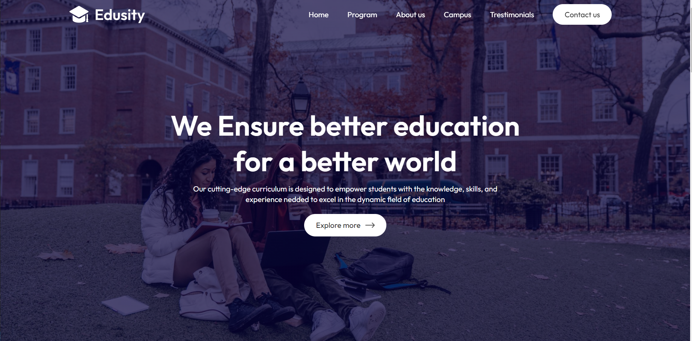
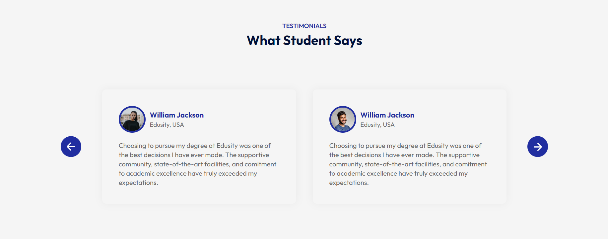
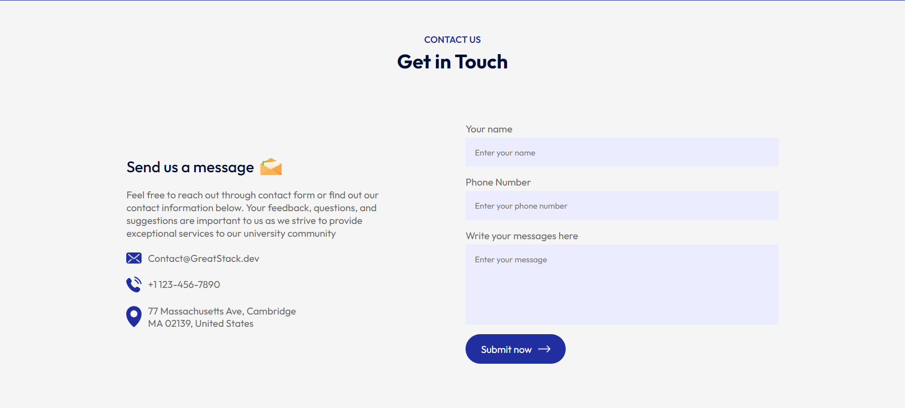

# Edusity University Website
Welcome to the Edusity University website! This project is a comprehensive university website built using HTML, CSS, JavaScript, and React.js. It includes various sections to provide detailed information about the university and its offerings. Below you'll find an overview of the project and how to set it up.

## Table of Contents
- [Project Overview](#project-overview)
- [Features](#features)
- [Technologies Used](#technologies-used)
- [Installation](#installation)
- [Usage](#usage)
- [Contributing](#contributing)
- [License](#license)

## Project Overview

The Edusity University website is designed to offer prospective and current students, faculty, and visitors a comprehensive view of the university. The website includes the following sections:

- **Home**: Introduction and highlights of the university.
- **Program**: Detailed information about the various programs and courses offered.
- **About Us**: Information about the university's history, mission, and values.
- **Campus**: Insights into campus life, facilities, and amenities.
- **Testimonials**: Feedback and experiences shared by students and alumni.
- **Contact Us**: A form to reach out to the university for inquiries.

## Features

- Responsive design ensuring compatibility with various devices.
- Interactive and dynamic content using React.js.
- Structured and well-organized layout for easy navigation.
- Contact form for direct communication with the university.

## Technologies Used

- **HTML**: Markup language for structuring the website content.
- **CSS**: Stylesheet language for designing and layout.
- **JavaScript**: Programming language for interactive and dynamic features.
- **React.js**: JavaScript library for building user interfaces.

## Installation

To set up the project locally, follow these steps:

1. **Clone the repository**:
    ```bash
    git clone https://github.com/sejal-sharma08/edusity-university-website.git
    ```
2. **Navigate to the project directory**:
    ```bash
    cd edusity-university-website
    ```
3. **Install the dependencies**:
    ```bash
    npm install
    ```
4. **Start the development server**:
    ```bash
    npm run dev
    ```

## Usage

After starting the development server, open your web browser and go to `http://localhost:5173` to view the website. You can navigate through different sections using the navigation bar.

## Contributing

We welcome contributions to improve the Edusity University website! If you have suggestions or improvements, please follow these steps:

1. Fork the repository.
2. Create a new branch:
    ```bash
    git checkout -b feature/your-feature-name
    ```
3. Make your changes and commit them:
    ```bash
    git commit -m "Add your message"
    ```
4. Push to the branch:
    ```bash
    git push origin feature/your-feature-name
    ```
5. Open a pull request.

## Screenshots
These are some snapshots of the project.







## License

This project is licensed under the MIT License. See the [LICENSE](LICENSE) file for more details.

---

Thank you for visiting Edusity University! We hope this website provides all the information you need. If you have any questions or need further assistance, feel free to use the contact form on the website.

Happy learning!
